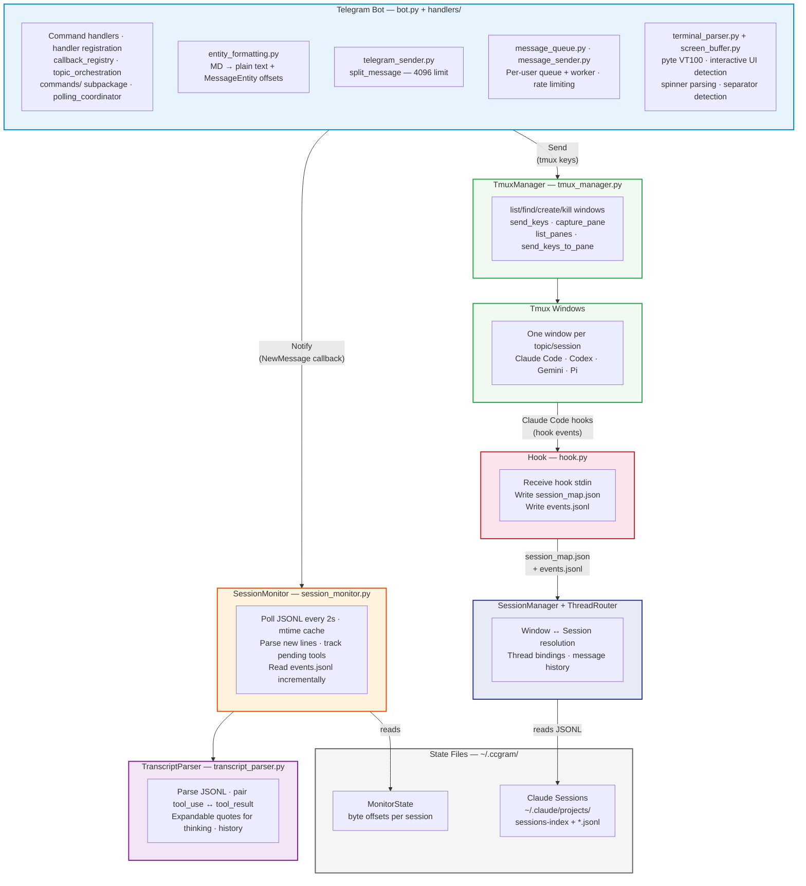

# System Architecture

## Module Inventory

### Provider modules (`providers/`)

| Module                 | Description                                                                                                    |
| ---------------------- | -------------------------------------------------------------------------------------------------------------- |
| `base.py`              | AgentProvider protocol, ProviderCapabilities, event types                                                      |
| `registry.py`          | ProviderRegistry (name→factory map, singleton cache)                                                           |
| `_jsonl.py`            | Shared JSONL parsing base class for Codex + Gemini + Pi                                                        |
| `claude.py`            | ClaudeProvider (hook, resume, continue, JSONL transcripts)                                                     |
| `codex.py`             | CodexProvider (resume, continue, JSONL transcripts, no hook)                                                   |
| `gemini.py`            | GeminiProvider (resume, continue, whole-file JSON transcripts, no hook)                                        |
| `pi.py`                | PiProvider (resume via `--session`, continue, JSONL v3 transcripts, no hook)                                   |
| `pi_format.py`         | Pi transcript parsers (user/assistant/toolResult/bashExecution, session header, pending-tool tracking)         |
| `pi_discovery.py`      | Pi command discovery (Telegram-safe builtins + skills + prompts + extension `pi.registerCommand` scans)        |
| `codex_status.py`      | Codex status snapshot builder (transcript parsing, activity detection)                                         |
| `codex_format.py`      | Codex interactive prompt formatter (permission/tool prompts)                                                   |
| `shell.py`             | Slim ShellProvider class (re-exports infrastructure from shell_infra for backward compat)                      |
| `shell_infra.py`       | Shell prompt-marker detection, KNOWN_SHELLS, PromptMatch, setup_shell_prompt — extracted from shell.py         |
| `process_detection.py` | Foreground process detection via `ps -t <tty>` with PGID caching for reliable provider identification          |
| `__init__.py`          | `get_provider_for_window()`, `detect_provider_from_pane()`, `detect_provider_from_command()`, `get_provider()` |

### LLM modules (`llm/`)

| Module               | Description                                                                                       |
| -------------------- | ------------------------------------------------------------------------------------------------- |
| `base.py`            | CommandGenerator + TextCompleter Protocols, CommandResult dataclass                               |
| `httpx_completer.py` | OpenAI-compatible + Anthropic completions via httpx (command gen + generic `complete()`)          |
| `summarizer.py`      | LLM-powered completion summary — reads transcript, produces single-line summary for Ready message |
| `__init__.py`        | LLM provider registry + `get_completer()` / `get_text_completer()` factories                      |

### Whisper modules (`whisper/`)

| Module                 | Description                                                   |
| ---------------------- | ------------------------------------------------------------- |
| `base.py`              | WhisperTranscriber Protocol + TranscriptionResult dataclass   |
| `httpx_transcriber.py` | OpenAI-compatible transcription via httpx (OpenAI, Groq, etc) |
| `__init__.py`          | Provider factory (`get_transcriber()` from config)            |

### Core modules (`src/ccgram/`)

| Module                    | Description                                                                                                                                                                                                                                                                                                                                                                                                            |
| ------------------------- | ---------------------------------------------------------------------------------------------------------------------------------------------------------------------------------------------------------------------------------------------------------------------------------------------------------------------------------------------------------------------------------------------------------------------- |
| `bot.py`                  | PTB Application factory + lifecycle delegates (172 lines after F3); compat re-exports for handlers patched in tests                                                                                                                                                                                                                                                                                                    |
| `bootstrap.py`            | Application bootstrap — `bootstrap_application()` (post_init wiring) + `shutdown_runtime()` (post_shutdown teardown). Splits `register_provider_commands`, `verify_hooks_installed`, `start_session_monitor`, `wire_runtime_callbacks`, `start_status_polling`, `start_miniapp_if_enabled` so each step is independently testable. Enforces ordering: `wire_runtime_callbacks` must run before `start_session_monitor` |
| `telegram_client.py`      | `TelegramClient` Protocol covering the bot API surface used by handlers (18 methods, grep-verified — no aspirational additions). `PTBTelegramClient(bot)` adapter delegates to a real PTB `Bot`. `FakeTelegramClient` records calls as `(method, kwargs)` tuples for tests. `unwrap_bot(client)` is the escape hatch for PTB-only helpers (`do_api_request` for `DraftStream`)                                         |
| `cc_commands.py`          | CC command discovery (skills, custom commands) + menu registration                                                                                                                                                                                                                                                                                                                                                     |
| `command_catalog.py`      | Provider-agnostic command discovery and caching — separates command-source from menu registration                                                                                                                                                                                                                                                                                                                      |
| `claude_task_state.py`    | Claude task tracking from transcripts — per-window task snapshots for live status bubble                                                                                                                                                                                                                                                                                                                               |
| `cli.py`                  | Click-based CLI entry point (run subcommand + all bot-config flags)                                                                                                                                                                                                                                                                                                                                                    |
| `config.py`               | Application configuration singleton (env vars, .env files, defaults)                                                                                                                                                                                                                                                                                                                                                   |
| `doctor_cmd.py`           | `ccgram doctor [--fix]` — validate setup without bot token                                                                                                                                                                                                                                                                                                                                                             |
| `mailbox.py`              | File-based mailbox: message CRUD, TTL expiration, sweep, ID migration, broadcast                                                                                                                                                                                                                                                                                                                                       |
| `monitor_state.py`        | Monitor state persistence — tracks byte offsets for each session                                                                                                                                                                                                                                                                                                                                                       |
| `main.py`                 | Application entry point (Click dispatcher, run_bot bootstrap)                                                                                                                                                                                                                                                                                                                                                          |
| `msg_cmd.py`              | `ccgram msg` CLI group: send, inbox, read, reply, broadcast, register, spawn                                                                                                                                                                                                                                                                                                                                           |
| `msg_discovery.py`        | Peer discovery: view over SessionManager + self-declared overlay (task, team)                                                                                                                                                                                                                                                                                                                                          |
| `msg_skill.py`            | Messaging skill auto-installation for Claude Code agents                                                                                                                                                                                                                                                                                                                                                               |
| `screen_buffer.py`        | pyte VT100 screen buffer (ANSI→clean lines, separator detection)                                                                                                                                                                                                                                                                                                                                                       |
| `screenshot.py`           | Terminal text → PNG rendering (ANSI color, font fallback)                                                                                                                                                                                                                                                                                                                                                              |
| `session.py`              | `SessionManager` — constructs and owns `WindowStateStore`, `ThreadRouter`, `UserPreferences`, `SessionMapSync` via constructor DI (no `_wire_singletons` monkey-patching, no `unwired_save` defaults — F2)                                                                                                                                                                                                             |
| `session_map.py`          | Session map I/O — reads/writes session_map.json, synchronises window states against hook data                                                                                                                                                                                                                                                                                                                          |
| `session_query.py`        | Read-only session resolution free functions — wraps `session_resolver` so handlers don't import `SessionManager`                                                                                                                                                                                                                                                                                                       |
| `session_resolver.py`     | JSONL session resolution — window-to-session lookup and message history extraction                                                                                                                                                                                                                                                                                                                                     |
| `spawn_request.py`        | Spawn request data types, file-based CRUD, public accessor API (get/pop/iter/register_pending)                                                                                                                                                                                                                                                                                                                         |
| `state_persistence.py`    | Atomic/debounced JSON persistence for state.json                                                                                                                                                                                                                                                                                                                                                                       |
| `status_cmd.py`           | `ccgram status` — show running state without bot token                                                                                                                                                                                                                                                                                                                                                                 |
| `telegram_request.py`     | Telegram request helpers for resilient long polling (custom HTTPX transport)                                                                                                                                                                                                                                                                                                                                           |
| `thread_router.py`        | ThreadRouter — thread bindings, display names, reverse index, chat ID resolution. Constructed by `SessionManager` with `schedule_save` and `has_window_state` callbacks; module-level `thread_router` is a proxy forwarding to the wired instance                                                                                                                                                                      |
| `toolbar_config.py`       | Toolbar layout configuration — per-provider button grids loaded from TOML                                                                                                                                                                                                                                                                                                                                              |
| `topic_state_registry.py` | Centralized registry for per-topic and per-window cleanup functions with self-registration decorator and `register_bound()` for instance methods                                                                                                                                                                                                                                                                       |
| `user_preferences.py`     | User directory favorites (starred/MRU) and per-user read offsets. Constructed by `SessionManager` with a `schedule_save` callback; module-level `user_preferences` is a proxy forwarding to the wired instance                                                                                                                                                                                                         |
| `utils.py`                | Shared utilities (ccgram_dir, tmux_session_name, atomic_write_json)                                                                                                                                                                                                                                                                                                                                                    |
| `window_query.py`         | Read-only window state free functions — lets handlers read window state without importing `SessionManager`                                                                                                                                                                                                                                                                                                             |
| `window_resolver.py`      | Window ID resolution, format helpers, and startup migration                                                                                                                                                                                                                                                                                                                                                            |
| `window_state_store.py`   | Window state storage — WindowState dataclass. Constructed by `SessionManager` with `schedule_save` and `on_hookless_provider_switch` callbacks; module-level `window_store` is a proxy forwarding to the wired instance                                                                                                                                                                                                |
| `window_view.py`          | Read-only WindowView projection — frozen snapshot used by handlers that only need to read window state                                                                                                                                                                                                                                                                                                                 |
| `expandable_quote.py`     | Sentinel constants and `format_expandable_quote()` — markup contract between transcript parsers and presentation                                                                                                                                                                                                                                                                                                       |

### Handler modules (`handlers/`)

After Round 4 (F1), the flat 50+ peer modules are grouped into feature subpackages. Each subpackage `__init__.py` re-exports the public surface; call sites use subpackage-qualified imports (`from .handlers.recovery import restore_command`). Handlers depend on the `TelegramClient` Protocol (F5), not `telegram.Bot` directly.

#### Top-level handlers (constants, leaves, top-level commands)

| Module                  | Description                                                                                                                                                                                                                                                                                         |
| ----------------------- | --------------------------------------------------------------------------------------------------------------------------------------------------------------------------------------------------------------------------------------------------------------------------------------------------- |
| `callback_data.py`      | CB\_\* callback data constants for inline keyboard routing                                                                                                                                                                                                                                          |
| `callback_helpers.py`   | Shared helpers (user_owns_window, get_thread_id)                                                                                                                                                                                                                                                    |
| `callback_registry.py`  | Prefix-based callback dispatch registry with self-registration decorator                                                                                                                                                                                                                            |
| `cleanup.py`            | Topic teardown orchestration via TopicStateRegistry + async bot cleanup                                                                                                                                                                                                                             |
| `command_history.py`    | Per-user/per-topic in-memory command recall (max 20)                                                                                                                                                                                                                                                |
| `file_handler.py`       | Photo/document handler (save to .ccgram-uploads/, notify agent)                                                                                                                                                                                                                                     |
| `hook_events.py`        | Hook event dispatcher (Stop, StopFailure, SessionEnd, Notification, Subagent*, Team*)                                                                                                                                                                                                               |
| `inline.py`             | Top-level `inline_query_handler` and `unsupported_content_handler` (no natural feature subpackage; documented exception — F5.7)                                                                                                                                                                     |
| `reactions.py`          | Telegram message reactions helper (Bot API 7.0+) — pure leaf used cross-package                                                                                                                                                                                                                     |
| `registry.py`           | Central PTB handler registration (`register_all`) — `CommandSpec` table + `MessageHandler`/`CallbackQueryHandler`/`InlineQueryHandler` wiring extracted from `bot.py` (F3.1). Documented exception to the "no `telegram.ext` runtime imports in handlers" rule: this is the PTB wiring spine (F5.7) |
| `response_builder.py`   | Response pagination and formatting                                                                                                                                                                                                                                                                  |
| `sessions_dashboard.py` | `/sessions` command: active session overview + kill                                                                                                                                                                                                                                                 |
| `sync_command.py`       | `/sync` command: sync window state with tmux                                                                                                                                                                                                                                                        |
| `upgrade.py`            | `/upgrade` command: uv tool upgrade + process restart                                                                                                                                                                                                                                               |
| `user_state.py`         | `context.user_data` string key constants                                                                                                                                                                                                                                                            |

#### `handlers/commands/` — `/commands` + `/toolbar` orchestration (Round 5 F4)

| Module               | Description                                                                                                                                                                                       |
| -------------------- | ------------------------------------------------------------------------------------------------------------------------------------------------------------------------------------------------- |
| `__init__.py`        | Public surface: `commands_command`, `toolbar_command`, re-exports of `forward_command_handler`, `setup_menu_refresh_job`, `get_global_provider_menu`, `set_global_provider_menu`, `sync_scoped_*` |
| `forward.py`         | Forward command handler (`forward_command_handler`, `_normalize_slash_token`, `_handle_clear_command`)                                                                                            |
| `menu_sync.py`       | Provider menu cache + scoped sync (`sync_scoped_provider_menu`, `sync_scoped_menu_for_text_context`, `setup_menu_refresh_job`, LRU helpers, `_build_provider_command_metadata`)                   |
| `failure_probe.py`   | Command failure probing (`_capture_command_probe_context`, `_probe_transcript_command_error`, `_spawn_command_failure_probe`, `_command_known_in_other_provider`)                                 |
| `status_snapshot.py` | Status snapshot delegation (`_status_snapshot_probe_offset`, `_maybe_send_status_snapshot`)                                                                                                       |

#### `handlers/interactive/` — interactive UI prompts

| Module                     | Description                                              |
| -------------------------- | -------------------------------------------------------- |
| `interactive_ui.py`        | AskUserQuestion / ExitPlanMode / Permission UI rendering |
| `interactive_callbacks.py` | Callbacks for interactive UI (arrow keys, enter, esc)    |

#### `handlers/live/` — live view + screenshots

| Module                    | Description                                                                                          |
| ------------------------- | ---------------------------------------------------------------------------------------------------- |
| `live_view.py`            | Live terminal view — auto-refreshing screenshot via editMessageMedia, content-hash gating, auto-stop |
| `screenshot_callbacks.py` | Screenshot callback handlers — screenshot capture, quick-key, live view toggle                       |
| `pane_callbacks.py`       | Per-pane callbacks (rename, screenshot select)                                                       |

#### `handlers/messaging/` — inter-agent messaging

| Module            | Description                                                                                            |
| ----------------- | ------------------------------------------------------------------------------------------------------ |
| `msg_broker.py`   | Broker delivery: idle detection, send_keys injection, rate limiting, loop detection                    |
| `msg_delivery.py` | Message delivery state: per-window tracking, rate limiting, loop detection (extracted from msg_broker) |
| `msg_spawn.py`    | Agent spawn requests with Telegram approval flow and auto-topic creation                               |
| `msg_telegram.py` | Telegram notifications for inter-agent messages (silent, grouped, edit-in-place)                       |

#### `handlers/messaging_pipeline/` — outbound message queue

| Module               | Description                                                                                                                                                  |
| -------------------- | ------------------------------------------------------------------------------------------------------------------------------------------------------------ |
| `message_queue.py`   | Per-user FIFO queue + worker — merge, status dedup, tool-use batching delegation. Worker takes `client: TelegramClient`                                      |
| `message_routing.py` | Inbound message routing — routes new assistant messages from SessionMonitor to Telegram topics                                                               |
| `message_sender.py`  | `safe_reply`/`safe_edit`/`safe_send` + `rate_limit_send_message` + `edit_with_fallback` — all take `client: TelegramClient`                                  |
| `message_task.py`    | Message task sum type — frozen dataclasses (ContentTask, StatusTask, ToolResultTask) shared by queue, tool_batch, and status_bubble without circular imports |
| `tool_batch.py`      | Claude tool-use batching — state machine, formatting, edit-in-place delivery; uses `unwrap_bot(client)` to drop down to PTB Bot for `DraftStream`            |
| `topic_commands.py`  | `/verbose` and `/toolcalls` per-topic toggles                                                                                                                |

#### `handlers/polling/` — status polling + per-window tick

| Module                    | Description                                                                                                                                                                                                                                                                                                                                                                        |
| ------------------------- | ---------------------------------------------------------------------------------------------------------------------------------------------------------------------------------------------------------------------------------------------------------------------------------------------------------------------------------------------------------------------------------- |
| `polling_coordinator.py`  | Polling coordinator — iterates thread bindings, delegates per-window work to `window_tick`, runs periodic/lifecycle tasks                                                                                                                                                                                                                                                          |
| `polling_types.py`        | Pure types module (Round 5 F1): `TickContext`, `TickDecision`, `PaneTransition`, `WindowPollState`, `TopicPollState`, all module-level constants (`STARTUP_TIMEOUT`, `RC_DEBOUNCE_SECONDS`, `MAX_PROBE_FAILURES`, `TYPING_INTERVAL`, `PANE_COUNT_TTL`, `ACTIVITY_THRESHOLD`, `SHELL_COMMANDS`), pure `is_shell_prompt`. Imports stdlib + `ccgram.providers.base.StatusUpdate` only |
| `polling_state.py`        | Stateful module (Round 5 F1): `TerminalPollState`, `TerminalScreenBuffer`, `InteractiveUIStrategy`, `TopicLifecycleStrategy`, `PaneStatusStrategy`, the five module-level singletons (`terminal_poll_state`, `terminal_screen_buffer`, `interactive_strategy`, `lifecycle_strategy`, `pane_status_strategy`), `reset_window_polling_state`                                         |
| `periodic_tasks.py`       | Periodic task orchestration: broker delivery, mailbox sweep, spawn processing, lifecycle, live view                                                                                                                                                                                                                                                                                |
| `window_tick/__init__.py` | Per-window poll cycle (`tick_window`) — thin orchestrator that gathers transcript and dispatches to apply functions                                                                                                                                                                                                                                                                |
| `window_tick/decide.py`   | Pure decision kernel (`decide_tick`, `build_status_line`, `is_shell_prompt`) — zero deps on tmux/PTB/singletons (F4)                                                                                                                                                                                                                                                               |
| `window_tick/observe.py`  | Pure inputs in, `TickContext` out — pane-text capture, last-activity lookup, screen-buffer parsing, status resolve, vim-insert detection (F4)                                                                                                                                                                                                                                      |
| `window_tick/apply.py`    | DI-heavy side effects — `_apply_*_transition`, `_update_status`, `_send_typing_throttled`, `_handle_dead_window_notification`, `_scan_window_panes`, pane forwarding (F4)                                                                                                                                                                                                          |

#### `handlers/recovery/` — dead window recovery + history

| Module                    | Description                                                                                                                                                                                                                            |
| ------------------------- | -------------------------------------------------------------------------------------------------------------------------------------------------------------------------------------------------------------------------------------- |
| `recovery_callbacks.py`   | Thin dispatcher (Round 5 F3, ~170 LOC): `_dispatch`, `handle_recovery_callback`, plus shared `_validate_recovery_state`/`_clear_recovery_state` validators — routes recovery callback prefixes to `recovery_banner` or `resume_picker` |
| `recovery_banner.py`      | Dead-window banner UX (Round 5 F3): `RecoveryBanner`, `render_banner`, `build_recovery_keyboard`, `_create_and_bind_window`, fresh/continue/resume/back/browse/cancel handlers                                                         |
| `resume_picker.py`        | Resume picker UX + transcript scan (Round 5 F3): `_SessionEntry`, `scan_sessions_for_cwd`, `_scan_index_for_cwd`, `_scan_bare_jsonl_for_cwd`, picker keyboard builders, `_handle_resume_pick`                                          |
| `restore_command.py`      | `/restore` command: recover dead topics via recovery keyboard                                                                                                                                                                          |
| `resume_command.py`       | `/resume` command: scan past sessions, paginated picker                                                                                                                                                                                |
| `transcript_discovery.py` | Hookless transcript discovery for Codex/Gemini, provider auto-detection, shell↔agent transitions                                                                                                                                       |
| `history.py`              | `/history` command and message history display with pagination                                                                                                                                                                         |
| `history_callbacks.py`    | History pagination callbacks (prev/next)                                                                                                                                                                                               |

#### `handlers/send/` — `/send` file delivery

| Module              | Description                                                              |
| ------------------- | ------------------------------------------------------------------------ |
| `send_command.py`   | File search, listing and upload utilities for the `/send` command        |
| `send_callbacks.py` | Callback handlers for `/send` file browser navigation                    |
| `send_security.py`  | Security validation for the `/send` command — multi-layer access control |

#### `handlers/shell/` — shell provider command flow

| Module                         | Description                                                                                                                                       |
| ------------------------------ | ------------------------------------------------------------------------------------------------------------------------------------------------- |
| `shell_commands.py`            | NL→command approval, dangerous command detection via LLM                                                                                          |
| `shell_capture.py`             | Prompt-marker output isolation, exit code detection, baseline-diff fallback, glyph stripping                                                      |
| `shell_context.py`             | Shared shell helpers — `gather_llm_context`, `redact_for_llm`, `_detect_shell_tools` (extracted to break shell_commands ↔ shell_capture coupling) |
| `shell_prompt_orchestrator.py` | Shell prompt marker setup orchestrator — centralizes five trigger sites into one `ensure_setup` entry point                                       |

#### `handlers/status/` — status bubble + topic emoji

| Module                  | Description                                                                                                                                                                         |
| ----------------------- | ----------------------------------------------------------------------------------------------------------------------------------------------------------------------------------- |
| `status_bubble.py`      | Status-bubble keyboard + status message lifecycle (send, edit, clear, format, dedup) — owns `_status_msg_info`, `send_status_text`, `clear_status_message`, `build_status_keyboard` |
| `status_bar_actions.py` | Status-bubble button callbacks (notify toggle, recall, remote control, esc, keys)                                                                                                   |
| `topic_emoji.py`        | Topic name emoji updates (active/idle/done/dead + RC/YOLO badges), debounced. Color scheme is configurable via `CCGRAM_STATUS_MODE`                                                 |
| `rc_probe.py`           | Remote Control outcome probe — `arm_rc_probe`, pure `classify_rc_output`, `_classify_loop` polling coroutine; classifies the pane after Claude `/remote-control`, posts one status reply, de-duped via in-memory `WindowState.rc_probe_state` (Claude-only) |

#### `handlers/text/` — text-message routing

| Module            | Description                                                 |
| ----------------- | ----------------------------------------------------------- |
| `text_handler.py` | Text message routing (UI guards → unbound → dead → forward) |

#### `handlers/toolbar/` — `/toolbar` inline keyboard

| Module                 | Description                                                                                                           |
| ---------------------- | --------------------------------------------------------------------------------------------------------------------- |
| `toolbar_keyboard.py`  | Toolbar keyboard builder — constructs the `/toolbar` inline keyboard from TOML config with per-window label overrides |
| `toolbar_callbacks.py` | Toolbar callback handlers — dispatch for `/toolbar` inline button clicks                                              |

#### `handlers/topics/` — topic lifecycle + window picker

| Module                   | Description                                                                            |
| ------------------------ | -------------------------------------------------------------------------------------- |
| `topic_orchestration.py` | New window/topic creation, unbound window adoption, rate limiting                      |
| `topic_lifecycle.py`     | Topic lifecycle management — autoclose timers for done/dead topics, unbound window TTL |
| `directory_browser.py`   | Directory selection UI for new topics + worktree picker/confirm keyboard builders      |
| `directory_callbacks.py` | Callbacks for directory browser (navigate, confirm, provider pick, worktree flow)      |
| `worktree.py`            | Pure git-worktree plumbing — `check_worktree_eligibility`, `suggest_branch_name`, `slug_for_path`, `worktree_path_for`, `validate_branch_name`, `create_worktree` (raises `WorktreeError`); no Telegram/tmux/state deps |
| `window_callbacks.py`    | Window picker callbacks (bind, new, cancel)                                            |
| `new_command.py`         | `/new` (and `/start` alias) handler — welcome message                                  |

#### `handlers/voice/` — voice transcription

| Module               | Description                                                                               |
| -------------------- | ----------------------------------------------------------------------------------------- |
| `voice_handler.py`   | Voice message download, transcription, confirm keyboard                                   |
| `voice_callbacks.py` | Voice callback routing (vc:send/vc:drop); shell provider transcriptions route through LLM |

### State files (`~/.ccgram/` or `$CCBOT_DIR/`)

| File                 | Description                                                      |
| -------------------- | ---------------------------------------------------------------- |
| `state.json`         | Thread bindings + window states + display names + read offsets   |
| `session_map.json`   | Hook-generated window_id→session mapping                         |
| `events.jsonl`       | Append-only hook event log (all hook events)                     |
| `monitor_state.json` | Poll progress (byte offset) per JSONL file                       |
| `mailbox/`           | Inter-agent message inboxes (per-window dirs with JSON messages) |

## Key Design Decisions

- **Topic-centric** — Each Telegram topic binds to one tmux window. No centralized session list; topics _are_ the session list.
- **Window ID-centric** — All internal state keyed by tmux window ID (e.g. `@0`, `@12`), not window names. Window IDs are guaranteed unique within a tmux server session. Window names are kept as display names via `window_display_names` map. Same directory can have multiple windows.
- **Hook-based event system** — Claude Code hooks (SessionStart, Notification, Stop, StopFailure, SessionEnd, SubagentStart, SubagentStop, TeammateIdle, TaskCompleted) write to `session_map.json` and `events.jsonl`. SessionMonitor reads both: session_map for session tracking, events.jsonl for instant event dispatch (interactive UI, done detection, API error alerting, session lifecycle, subagent status, team notifications). Terminal scraping remains as fallback. Missing hooks are detected at startup with an actionable warning.
- **Multi-pane awareness** — Windows with multiple panes (e.g. Claude Code agent teams) are scanned for interactive prompts in non-active panes. Blocked panes are auto-surfaced as inline keyboard alerts. `/panes` command lists all panes with status and per-pane screenshot buttons. Callback data format extended to include pane_id: `"aq:enter:@12:%5"`.
- **Tool use ↔ tool result pairing** — `tool_use_id` tracked across poll cycles; tool result edits the original tool_use Telegram message in-place.
- **Entity-based formatting** — All messages go through `safe_reply`/`safe_edit`/`safe_send` which convert markdown to plain text + `MessageEntity` offsets via `telegramify-markdown`, falling back to plain text on failure. No parse errors possible.
- **No truncation at parse layer** — Full content preserved; splitting at send layer respects Telegram's 4096 char limit with expandable quote atomicity.
- Only sessions registered in `session_map.json` (via hook) are monitored.
- Notifications delivered to users via thread bindings (topic → window_id → session).
- **Startup re-resolution** — Window IDs reset on tmux server restart. On startup, `resolve_stale_ids()` matches persisted display names against live windows to re-map IDs. Old state.json files keyed by window name are auto-migrated.
- **Per-window provider** — All CLI-specific behavior (launch args, transcript parsing, terminal status, command discovery) is delegated to an `AgentProvider` protocol. Providers declare capabilities (`ProviderCapabilities`) that gate UX features per-window: hook checks, resume/continue buttons, and command registration. Each window stores its `provider_name` in `WindowState`; `get_provider_for_window(window_id)` resolves the correct provider instance, falling back to the config default. Externally created windows are auto-detected via `detect_provider_from_command(pane_current_command)`. The global `get_provider()` singleton remains for CLI commands (`doctor`, `status`) that lack window context.
- **Inter-agent messaging** — File-based mailbox system (`~/.ccgram/mailbox/`) with per-window inbox directories. Qualified IDs (`session:@N`) match session_map convention. Broker delivery injects messages into idle windows via send_keys; shell windows are inbox-only. Telegram notifications are silent and grouped. Spawn approval requires Telegram keyboard confirmation. `CCGRAM_WINDOW_ID` env var set on window creation for agent self-identification.
- **Foreign window support (emdash)** — Windows owned by external tools (emdash) use qualified IDs like `emdash-claude-main-abc123:@0` which are valid tmux `-t` targets. Foreign windows are marked `WindowState.external=True` and are never killed by ccgram. Discovery via `tmux list-sessions` filtered by `emdash-` prefix. The `window_resolver` preserves foreign entries during startup re-resolution. All tmux operations (send_keys, capture_pane) route foreign IDs through subprocess instead of libtmux.
- **Live terminal view** — Auto-refreshing screenshots via `editMessageMedia` at configurable intervals (default 5s). Content-hash gating skips API calls when the terminal hasn't changed. One active view per topic, auto-stops after timeout (default 300s). Managed by `handlers/live/live_view.py`, ticked from `handlers/polling/periodic_tasks.py`.
- **Completion summaries** — On agent Stop events, `llm/summarizer.py` reads the session transcript and produces a single-line summary that edits the Ready message in-place. Non-blocking — the static enriched Ready message appears immediately, LLM enhancement arrives ~1-2s later.
- **Constructor DI for stores (F2)** — `SessionManager` constructs `WindowStateStore`, `ThreadRouter`, `UserPreferences`, and `SessionMapSync` with explicit `schedule_save` (and store-specific) callbacks. The legacy `_wire_singletons` monkey-patch and `unwired_save` silent default are gone. Module-level `window_store` / `thread_router` / `user_preferences` / `session_map_sync` are proxy objects that forward to the wired instance, preserving existing call sites without churn. `register_*_callback` helpers (`register_stop_callback`, `register_rc_active_provider`, `register_approval_callback`) raise on double-registration and the unwired callee defaults raise `RuntimeError("not wired")` so missed wires fail loud.
- **Bootstrap split (F3)** — `bot.py` is a 172-line factory + lifecycle delegate. Command/message/callback handler registration lives in `handlers/registry.py` (`register_all`); post_init wiring lives in `bootstrap.py` (`bootstrap_application`, with named steps `register_provider_commands`, `verify_hooks_installed`, `wire_runtime_callbacks`, `start_session_monitor`, `start_status_polling`, `start_miniapp_if_enabled`). Ordering invariant: `wire_runtime_callbacks` must run before `start_session_monitor`, enforced by a `_callbacks_wired` flag.
- **TelegramClient Protocol (F5)** — Handlers depend on `TelegramClient` (in `src/ccgram/telegram_client.py`) instead of `telegram.Bot`. `PTBTelegramClient(bot)` adapts a real PTB Bot in production; `FakeTelegramClient` records calls as `(method, kwargs)` tuples for tests. The Protocol covers exactly the 18 grep-verified bot API methods used by the codebase. Allowed `from telegram.ext` runtime importers: `bot.py`, `bootstrap.py`, `handlers/registry.py`, `telegram_client.py`, `telegram_request.py`, `telegram_sender.py`. Everything else uses `if TYPE_CHECKING:` for types. `unwrap_bot(client)` is the escape hatch for PTB-only helpers (`do_api_request` for `DraftStream`).
- **Pure decision kernel for window tick (F4)** — `handlers/polling/window_tick/` is a subpackage with `decide.py` (pure, zero deps on tmux/PTB/singletons), `observe.py` (pure inputs in, `TickContext` out), and `apply.py` (the only side-effect file). `decide_tick` and helpers are unit-tested without mocks.
- **Pure types vs stateful split for polling (Round 5 F1)** — `polling_strategies.py` was deleted; `polling_types.py` (~150 LOC, stdlib + `ccgram.providers.base.StatusUpdate` only) holds the contracts (`TickContext`, `TickDecision`, `PaneTransition`, `WindowPollState`, `TopicPollState`, constants, pure `is_shell_prompt`); `polling_state.py` (~900 LOC) holds the strategies and module-level singletons. `decide.py` imports only from `polling_types`. Codified by `tests/ccgram/handlers/polling/test_polling_types_purity.py` (subprocess load-time + AST static check).
- **Single read path through query layer (Round 5 F2)** — Handler reads of window/session state go through `window_query` / `session_query` free functions; direct `session_manager.<attr>` access in `handlers/**` is restricted to a documented write/admin allow-list (`set_window_provider`, `set_window_origin`, `set_window_approval_mode`, `cycle_*`, `audit_state`, `prune_*`, `sync_display_names`). Codified by `tests/ccgram/test_query_layer_only_for_handlers.py` — an AST walk over 86 handler files asserts every read access is on the allow-list.
- **Recovery split (Round 5 F3)** — `recovery_callbacks.py` is now a thin dispatcher (~170 LOC: routing + the shared `_validate_recovery_state`/`_clear_recovery_state` validators that both siblings need). The dead-window banner UX moved to `recovery_banner.py` (~450 LOC); the resume-picker UX + transcript scan moved to `resume_picker.py` (~400 LOC). Subpackage `__init__.py` re-exports the same public surface; pinned by `tests/ccgram/handlers/recovery/test_recovery_subpackage_surface.py`.
- **Commands subpackage (Round 5 F4)** — `command_orchestration.py` was deleted; `handlers/commands/` follows the `shell/` pattern: `forward.py` (forward command), `menu_sync.py` (provider menu cache + scoped sync), `failure_probe.py` (transcript failure probing), `status_snapshot.py`. `commands/__init__.py` hosts `commands_command` + `toolbar_command` and re-exports the public surface; pinned by `tests/ccgram/handlers/commands/test_commands_subpackage_surface.py`.
- **Lazy-import contract enforcement (Round 5 F5)** — `scripts/lint_lazy_imports.py` walks `src/ccgram/**/*.py` via AST and flags every in-function `Import`/`ImportFrom` not preceded by `# Lazy:`, not inside `if TYPE_CHECKING:`, and not inside `_reset_*_for_testing`. The walker recurses through compound statements (`try`/`except`/`except*`/`finally`/`if`/`else`/`with`/`for`/`while`) and into nested `def`/`class` bodies, and accepts multi-line `# Lazy:` comment blocks. Wired into `make lint` as `lint-lazy`. All 250 in-function imports are annotated. `tests/integration/test_import_no_cycles.py` enumerates all 162 modules under `src/ccgram/` programmatically (was 29 hand-listed).
