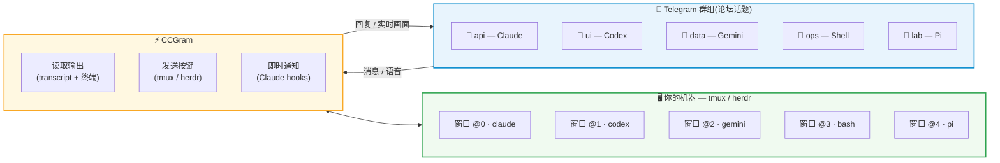

# CCGram — 用 Telegram 远程操控 AI 编程助手

> [English](README.en.md) | 中文

[](https://github.com/alexei-led/ccgram/actions/workflows/ci.yml)
[](https://pypi.org/project/ccgram/)
[](LICENSE)

**用手机操控 AI 编程助手。** 会话进行到一半也可以随时离开电脑,在 Telegram 上继续监控和回复——终端访问权不会丢失。

## 为什么选择 CCGram?

AI 编程助手运行在你的终端里。其他 Telegram 机器人是把 agent SDK 包装成孤立的 API 会话,你没法回到终端里继续。**CCGram 不一样。** 它构建在终端复用器(tmux 或 herdr)之上,而不是任何 agent SDK 之上。你的 agent 进程留在原处——你的会话就是唯一事实来源。

这意味着:

- **桌面到手机,对话不中断** — 人离开电脑,在 Telegram 上继续监控
- **手机回到桌面,随时切换** — attach 回终端,完整回滚缓冲区都在
- **多会话并行** — 每个 Telegram 话题对应一个独立窗口,可各自运行不同的 agent

---

## 工作原理



每个 Telegram 话题映射到一个复用器窗口。在 Telegram 输入 → 按键发送到 pane → agent 输出回传到 Telegram。

---

## 功能一览

- **话题绑定 agent** — 一个话题一个 agent;通过目录浏览器创建
- **自动识别 provider** — 同时支持 Claude Code、Codex、Gemini、Pi 和 Shell
- **实时监控** — 按需截取终端截图,或每 5 秒自动刷新
- **多种输入方式** — 斜杠命令、语音消息(经 Whisper 转写)、原始 shell 输入
- **多 agent 并行** — 每个话题相互独立,可同时运行不同 agent
- **优雅恢复** — 会话崩溃后可 resume、continue 或重新开始
- **发送工作区文件** — 通过 `/send` 把文件分享到 Telegram(支持 glob、路径或子串搜索)
- **操作工具栏** — 各 provider 专属的常用操作按钮(截图、模式、Esc、Enter 等)

---

## 快速开始

**安装:**

```bash
uv tool install ccgram          # 推荐
# 或: pipx install ccgram | brew install alexei-led/tap/ccgram
```

**Telegram 配置:**

1. 通过 [@BotFather](https://t.me/BotFather) 创建机器人 — [完整教程](docs/guides.md#getting-started)
2. 把机器人加入一个开启了「话题(Topics)」的 Telegram 群组,并提升为管理员——**务必勾选「管理话题(Manage Topics)」权限**(自动建话题和状态表情都依赖它)
3. 创建 `~/.ccgram/.env`:

```ini
TELEGRAM_BOT_TOKEN=your_bot_token_here
ALLOWED_USERS=your_telegram_user_id
CCGRAM_GROUP_ID=your_telegram_group_id
```

用户 ID 可从 [@userinfobot](https://t.me/userinfobot) 获取。群组 ID 可通过 [@RawDataBot](https://t.me/RawDataBot) 获取(在 Peer ID 前加 `-100` 前缀)。

**运行:**

```bash
ccgram
```

打开你的 Telegram 群组,新建一个话题,发送一条消息——目录浏览器随即出现。选择项目目录,挑选你的 agent(Claude、Codex、Gemini、Pi 或 Shell),连接完成。

**前置条件:** Python 3.14+、[tmux](https://github.com/tmux/tmux) 或 [herdr](https://github.com/ogulcancelik/herdr)(CCGram 操控的是终端复用器,无需修改任何 agent SDK),以及至少一个 agent CLI(已安装并登录的 `claude`、`codex`、`gemini`、`pi`,或直接使用无需额外安装的 `shell`)。

---

## 文档

- **[使用指南](docs/guides.md)** — CLI 参考、配置、语音转写、多实例部署、会话恢复、测试、**生产部署(systemd + 看门狗 + 日志落盘)**
- **[Provider 说明](docs/providers.md)** — Claude Code、Codex、Gemini、Pi、Shell;会话模式、LLM 配置、自定义命令、git worktree

---

## 可选功能

**Web 仪表盘** — 实时终端(xterm.js)、transcript 搜索、Telegram 内多 pane 网格视图。默认关闭。[开启方法](docs/guides.md#configuration)

---

## 开发

```bash
git clone https://github.com/alexei-led/ccgram.git && cd ccgram
uv sync --extra dev
make check         # lint、格式化、类型检查、测试
make test-e2e      # 端到端测试(需要 agent CLI;见 docs/guides.md#e2e-tests)
```

---

## 许可证

[MIT](LICENSE)
