# ccgram Architecture

Generated from code state 2026-08-26.

## System Overview

ccgram maps each Telegram Forum topic to one terminal-multiplexer window running one agent CLI (Claude Code, Codex, Gemini, Pi, or Shell). All internal routing is keyed by window ID (`@0`, `@12`). Multiplexer access goes through the `multiplexer/` seam (`Multiplexer` Protocol); tmux is the default backend and herdr is selectable via `CCGRAM_MULTIPLEXER=herdr`.

When `CCGRAM_MEMBER_LANES=true`, the physical forum topic remains one canonical
workspace, but each allow-listed operator is routed to an isolated derived
window/session. In eligible Git repositories, every derived lane runs in its
own worktree and branch. This mode is provider-neutral and does not depend on a
CLI exposing native sub-agents.

## Multi-Operator Topic Architecture

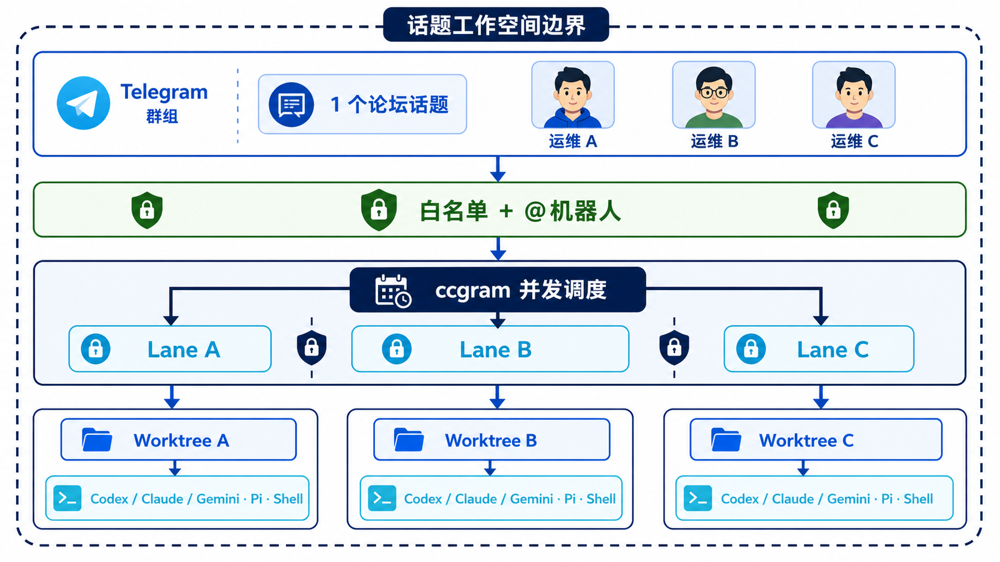

### Persistent Telegram operations dashboard

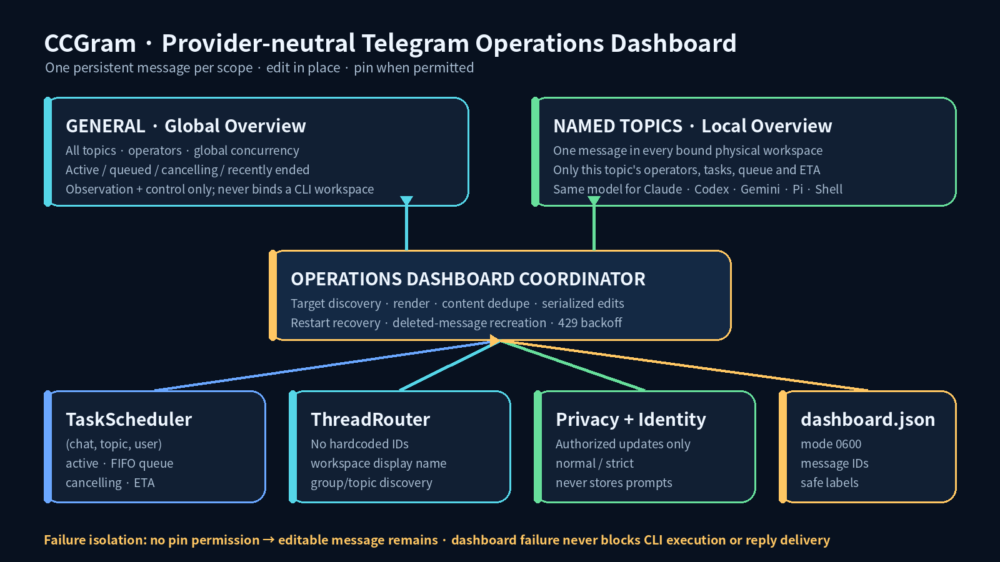

`operations_dashboard.py` observes the shared `TaskScheduler` and
`ThreadRouter`; it never parses provider output. With scope `both`, one message
in General summarizes the group while one message in every bound named topic
shows only that physical workspace. Message IDs and safe operator labels are
stored in mode-`0600` `dashboard.json`, so restarts continue editing in place.
A deleted message is recreated. Missing pin permission degrades to an unpinned
editable message and never blocks task execution or answer delivery. Prompt
text, terminal output, paths, tokens, and secrets are excluded from frames.

### Cancellation state machine

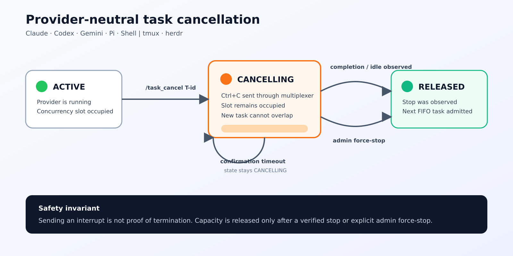

Cancellation uses the scheduler and multiplexer seams rather than any
provider-specific command, so Claude, Codex, Gemini, Pi, Shell, tmux, and herdr
share the same safety guarantees. A queued task can be removed immediately. An
active task moves to `cancelling`, receives Ctrl+C, and continues to occupy its
topic/global capacity slot until an observable stop signal arrives. Timeout is
an operator-visible state, not success; an admin may then force-stop the lane's
window without deleting its topic binding, transcript history, or workspace.
The generic active-task lease cannot release a `cancelling` task, including
after a ccgram restart.

Every transition is appended to `task-audit.jsonl` (mode `0600`, bounded
rotation) and summarized by `/ops`. Prompt text is intentionally excluded.

The routing identities are deliberately separate:

| Concern | Stable key | Meaning |
| --- | --- | --- |
| Physical workspace | `(chat_id, thread_id)` | Hard boundary; a topic never discovers or reuses another topic's workspace |
| Operator lane | `(chat_id, thread_id, user_id)` | One provider process, transcript, context, queue, and optional worktree per member |
| Request correlation | `(window_id, user_id, message_id)` | Final assistant text replies to the exact Telegram question that started it |
| Access control | `ALLOWED_USERS` | Authentication only; it never selects a different topic workspace |

### Inbound execution

1. Group text is accepted only from an `ALLOWED_USERS` member and, by default,
   only when it mentions the bot or replies to a bot message. Unauthorized
   group input is ignored silently.
2. `OperatorUpdateProcessor` permits different users to run concurrently but
   serializes one user's updates. This preserves PTB `user_data` state-machine
   safety while removing the previous global one-update bottleneck.
3. The first topic binding is canonical. A later member is provisioned by
   `handlers/text/member_lanes.py`, using the canonical lane's cwd and provider.
4. The derived lane always starts in normal approval mode. YOLO/bypass flags
   are never inherited automatically across operators.
5. A clean Git workspace gets a `ccg/member-<thread>-<user>` worktree branch.
   Dirty, detached, merging/rebasing, or non-Git workspaces fail closed unless
   `CCGRAM_ALLOW_SHARED_MEMBER_CWD=true` is explicitly configured.

### Outbound execution

Each derived window owns a different provider session ID, so transcript routing
resolves to exactly one `(user_id, window_id, thread_id)` binding. The outbound
queue remains isolated by `(user_id, thread_id)`. `request_context.py` carries
the original Telegram `message_id` into `ContentTask`; the first final response
part is sent as a reply to that message. Durable outbox replay preserves this
field across a ccgram restart.

`inbound_store.py` journals Telegram message IDs and dispatch state before a
provider send. `queued` rows are recoverable; `dispatching` rows are ambiguous
and are deliberately never replayed after a crash. `task_scheduler.py` persists
active admissions separately so restart does not temporarily exceed topic or
global limits. Both files are mode `0600` because the inbound journal contains
operator prompt text.

### Provider compatibility

The scheduler launches a separate multiplexer window through the common
`Multiplexer.create_window()` and `resolve_launch_command()` seams. Claude,
Codex, Gemini, Pi, and Shell therefore share identical isolation semantics.
Provider-native Sub-Agent/Multi-Agent features may still be used *inside* one
lane, but are optional acceleration, never a correctness dependency.

### Failure and lifecycle policy

- Persistent topic capacity defaults to eight member lanes.
- Active execution defaults to two different operators per topic and four
  globally. `CCGRAM_MAX_PARALLEL_PER_TOPIC` and
  `CCGRAM_MAX_PARALLEL_GLOBAL` configure both limits; excess work waits FIFO.
- More input from one active operator is a continuation in the same CLI lane,
  not another task or capacity slot. The original root-message correlation is
  preserved while supplemental reply text is appended as explicit context.
- Task IDs and the slot-duration moving average persist in `tasks.json`. Queue ETA
  is advisory; admission still follows actual FIFO eligibility and both hard
  concurrency limits.
- Graceful cancellation never releases capacity merely because Ctrl+C was
  sent. `cancelling` remains a live scheduler state until provider completion,
  native idle status, a verified Shell prompt, or an explicit admin force-stop.
- Rapid non-reply messages may be coalesced by `CCGRAM_MESSAGE_COALESCE_MS`.
  Every Telegram message ID is claimed durably before the delay, so redelivery
  cannot create a second provider task.
- Role checks precede every command/message/callback path: viewers are read-only,
  operators own their lane tasks, and admins own destructive/global actions.
  Raw Shell (`!`), dangerous generated Shell commands, and YOLO/bypass launch
  modes are admin-only.
- Archived member worktrees are removable only when clean and merged. Automatic
  retention uses the same fail-closed check and destructive-action audit; file
  overlap warnings are advisory and never auto-merge branches.
- Telegram handler concurrency defaults to eight, while window creation obeys
  the configurable global task limit.
- A failed provider startup remains bound and reports a retryable error; the
  original message is not typed into an unexpected shell.
- Closing a physical topic unbinds every member. Derived provider windows are
  stopped so they cannot be adopted by another topic; their Git worktrees and
  branches remain on disk for recovery. The canonical workspace window keeps
  the historic unbound/rebind behavior.
- One member lane is one interactive CLI conversation. If the same member sends
  another prompt while that CLI is busy, it supplements that active task using
  the provider's steer/follow-up semantics and never starts a parallel session.
  Independent concurrent jobs from the same person should use separate topics.

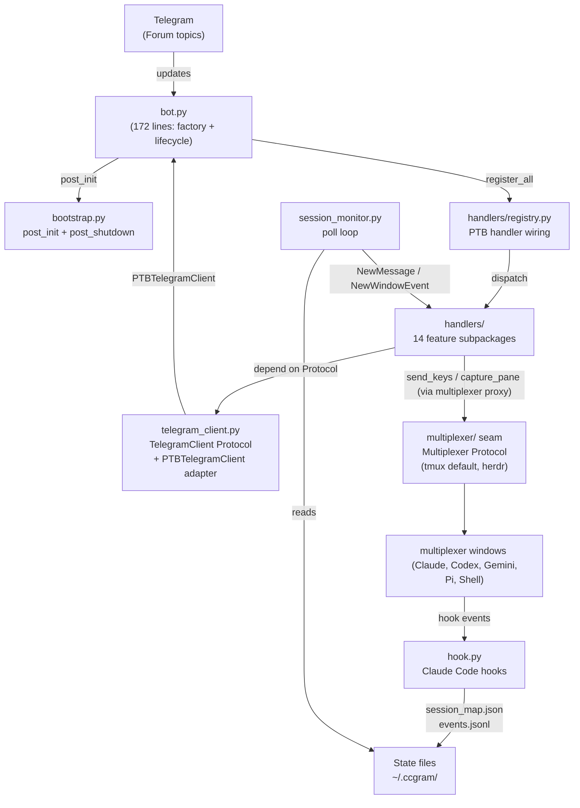

## Module Layers

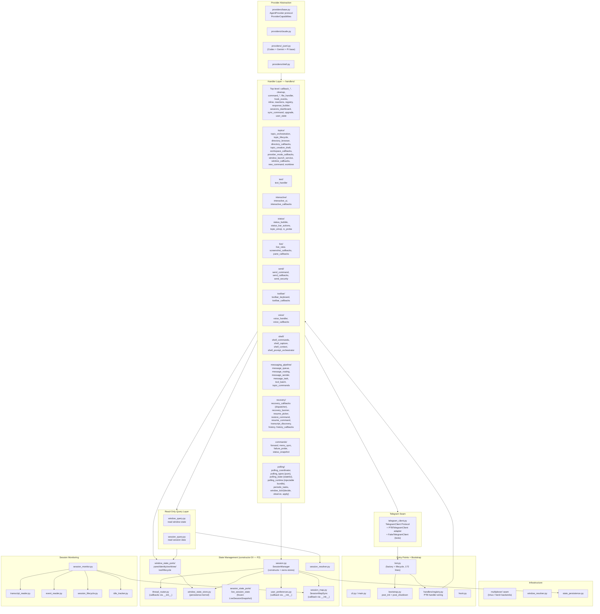

## State Flow: Topic → Window → Session

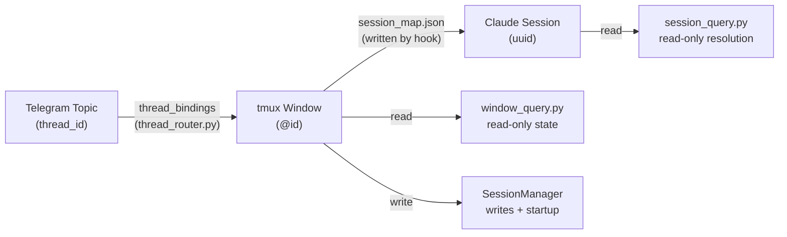

## SessionManager Responsibilities

`SessionManager` constructs and owns the four state stores (`WindowStateStore`, `ThreadRouter`, `UserPreferences`, `SessionMapSync`) via constructor DI with explicit `schedule_save` callbacks. Its public surface is now small: startup orchestration (`__post_init__`, `resolve_stale_ids`), write coordination (`set_window_provider`, `set_window_cwd`, `set_*_mode`, `set_display_name`), and cross-cutting audit (`audit_state`, `prune_stale_state`, `prune_stale_window_states`).

Read paths bypass `SessionManager`:

- `window_query.py` — `get_window_provider()`, `get_approval_mode()`, `get_notification_mode()`, `view_window()`; feature-shaped reads delegate to `window_state_ports/*`.
- `window_state_ports/` — `pane_state`, `identity_state`, `worktree_state`, `tool_state`, `lifecycle_state`. Frozen projection dataclasses for handlers and Mini App, plus cohesive feature writes (pane upsert/remove/lifecycle, worktree metadata, batch mode, tool-call visibility, origin). Provider/session identity writes still delegate to `SessionManager.set_window_provider`.
- `session_query.py` — `resolve_session_for_window()`, `find_users_for_session()`, `get_recent_messages()`.
- `session_map_sync` (direct imports) — `load/prune/register`.
- `thread_router` (direct imports) — `get_display_name()`.

`WindowStateStore` remains the single persistence kernel for `WindowState`. Handler and Mini App reads of window state go through `window_query` or `window_state_ports/*` — never raw `WindowState` fields. Boundary enforced by `tests/ccgram/test_window_state_access_audit.py` (raw feature-field access permitted only in `window_state_store.py`, `window_state_ports/*`, `session.py`, `window_query.py`, and serialization tests) and `tests/ccgram/test_query_layer_only_for_handlers.py` (write/admin allow-list).

## Provider Protocol

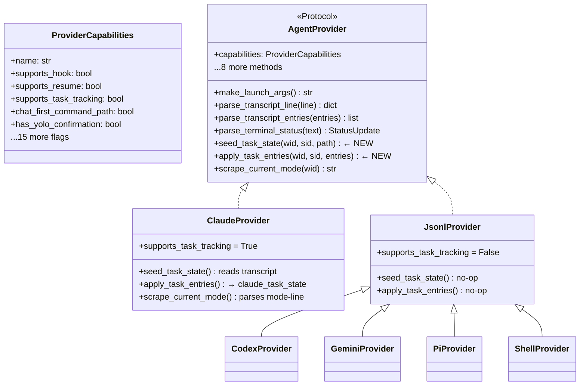

## Message Routing Flow

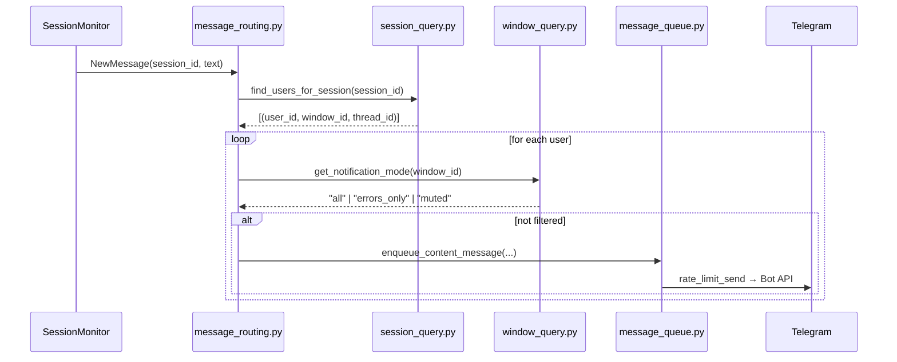

## Hook Event Flow

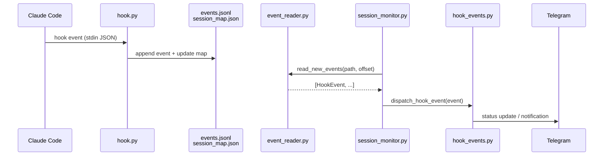

## Shell Provider Architecture

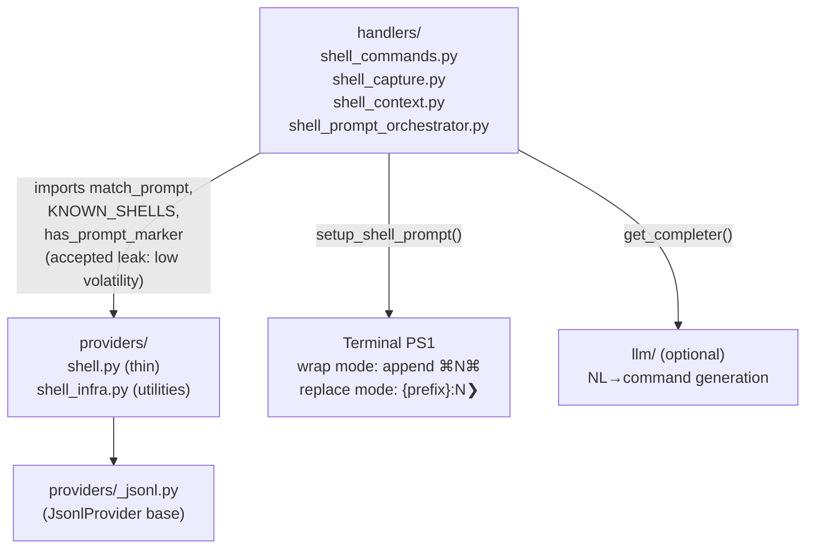

## Session Monitoring Architecture

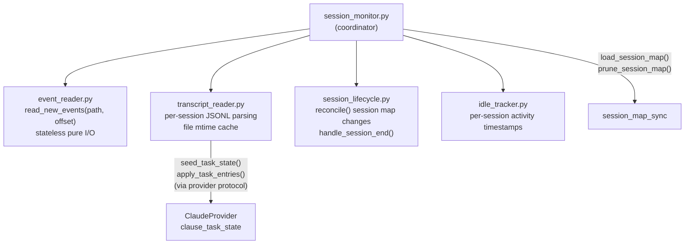

## Key Design Decisions

| Decision                                          | Rationale                                                                                                                                                                                                                                                                                                                                                                                                                                             |
| ------------------------------------------------- | ----------------------------------------------------------------------------------------------------------------------------------------------------------------------------------------------------------------------------------------------------------------------------------------------------------------------------------------------------------------------------------------------------------------------------------------------------- |
| Window ID-centric routing (`@0`, `@12`)           | Unique within a tmux server; window names are display-only                                                                                                                                                                                                                                                                                                                                                                                            |
| Hook-based event system                           | Instant stop/done/notification detection without terminal polling; events appended to `events.jsonl` and consumed incrementally                                                                                                                                                                                                                                                                                                                       |
| `window_query` / `session_query`                  | Handlers read window/session state via free functions, never importing `SessionManager`. Direct `session_manager.<attr>` in `handlers/**` is restricted to a documented write/admin allow-list                                                                                                                                                                                                                                                        |
| `window_state_ports/` feature ports               | `WindowStateStore` is the single persistence kernel; `window_state_ports/{pane,identity,worktree,tool,lifecycle}_state` are thin adapters exposing frozen projections plus cohesive feature writes. Raw `WindowState`-field access outside the kernel, the ports, `session.py`, `window_query.py`, and serialization tests fails `test_window_state_access_audit.py`. Provider identity writes still delegate to `SessionManager.set_window_provider` |
| Provider protocol with capability flags           | Gate UX features (resume, continue, hooks, YOLO, mode scraping, RC, picker hints) without `if provider == "claude"` checks                                                                                                                                                                                                                                                                                                                            |
| `supports_task_tracking` capability               | `transcript_reader` is provider-agnostic; only Claude implements task state                                                                                                                                                                                                                                                                                                                                                                           |
| Tool-call visibility on `WindowState`             | Per-window `tool_call_visibility` (`default`/`shown`/`hidden`) gates `_handle_content_task` before batch eligibility; hook events bypass                                                                                                                                                                                                                                                                                                              |
| Status-mode color schemes                         | `CCGRAM_STATUS_MODE` selects `system` (green = working) or `user` (green = ready) — only emoji rendering changes, not internal state names                                                                                                                                                                                                                                                                                                            |
| Gemini JSONL incremental reads                    | Gemini CLI v0.40+ uses append-only JSONL; provider inherits `JsonlProvider` byte-offset reader, dedupes by message id and pending tool_use                                                                                                                                                                                                                                                                                                            |
| Viewport screenshots                              | `/screenshot` and 📷 capture the current viewport with ANSI color; live view uses the same viewport capture at a smaller font size. `/last` (📄 Last toolbar button) delivers the last assistant reply text (AI providers, from transcript) or last command+output block (shell) as a message or `.txt` attachment for overflow                                                                                                                       |
| Picker hints                                      | `ProviderCapabilities.tui_picker_commands` lists modal-opening slash commands; `forward._picker_hint()` adds a hint pointing at `/toolbar` when one is forwarded, with the hint text adapted to the resolved `ToolbarLayout`                                                                                                                                                                                                                          |
| `handlers/` feature subpackages                   | Handlers are grouped into 14 feature subpackages; each `__init__.py` re-exports the public surface                                                                                                                                                                                                                                                                                                                                                    |
| Constructor DI for stores                         | `SessionManager` constructs `WindowStateStore`/`ThreadRouter`/`UserPreferences`/`SessionMapSync` with explicit `schedule_save` callbacks; no `_wire_singletons` and no silent unwired defaults — `register_*_callback` fails loud                                                                                                                                                                                                                     |
| `bot.py` is a factory + lifecycle only            | 172 lines; `handlers/registry.py` owns PTB handler wiring; `bootstrap.py` owns `post_init` (ordered: `register_provider_commands` → `verify_hooks_installed` → `wire_runtime_callbacks` → `start_session_monitor` → `start_status_polling` → `start_miniapp_if_enabled`) and `post_shutdown`                                                                                                                                                          |
| `window_tick/decide,observe,apply`                | Pure decision kernel (`decide.py`, zero deps on tmux/PTB/singletons) + pure observer (`observe.py`, `TickContext` out) + side-effect applier (`apply.py`); `decide_tick` is unit-tested without mocks                                                                                                                                                                                                                                                 |
| `TelegramClient` Protocol                         | Handlers depend on `TelegramClient` not `telegram.Bot`; `PTBTelegramClient` adapts in production, `FakeTelegramClient` records in tests. Only `bot.py`, `bootstrap.py`, `handlers/registry.py`, `telegram_client.py`, `telegram_request.py`, `telegram_sender.py` import from `telegram.ext` at runtime                                                                                                                                               |
| Pure types vs stateful polling                    | `polling_types.py` holds contracts (stdlib + `providers.base.StatusUpdate` only); `polling_state.py` holds strategies + module-level singletons; `decide.py` imports only from `polling_types`. Pinned by `test_polling_types_purity.py`                                                                                                                                                                                                              |
| Injectable `PollingRuntime` bundle                | The five polling strategy instances are bundled in `polling_runtime.PollingRuntime`. `get_default_runtime()` wraps existing singletons (no re-registration). `PollingRuntime.create()` builds an isolated bundle for tests. `tick_window`, `observe`, and `apply` accept `runtime: PollingRuntime \| None = None`. Import direction: `polling_runtime` → `polling_state` only. Gate: `test_polling_runtime.py`                                        |
| `session_state_ports/` live-session read contract | Volatile live-session reads (task snapshot, wait header, session-id, last-activity) go through `session_state_ports/live_session_state.py`. Direct handler imports of `get_claude_task_snapshot`, `get_claude_wait_header`, or `claude_task_state.has_snapshot` are banned. Write authority stays in `session_lifecycle`. Gate: `test_session_state_ports_audit.py`                                                                                   |
| State-file contracts in `hooks/state_files.py`    | `EventLogRecord`/`SessionMapEntry` are the canonical record types for `events.jsonl` and `session_map.json`. All production writes use `serialize_*`; all reads use `parse_*`. File I/O and locking stay in `hook.py`/`session_map.py`. `state_files.py` is stdlib-only                                                                                                                                                                               |
| Topic-creation seam split                         | `directory_callbacks.py` is a thin dispatcher; `topic_creation_draft.py` owns the 14 flow-state keys; `workspace_callbacks.py` handles workspace picker; `provider_mode_callbacks.py` handles provider/mode selection; `window_launch_service.py` owns window creation, race guard, thread bind, and pending-text forwarding                                                                                                                          |
| Transcript parser delegation                      | `transcript_parser.parse_entries` delegates to small per-type handlers (`_handle_assistant_message`, `_handle_tool_use_entry`, etc.); public API unchanged. Characterization tests cover all 12 entry types before refactor                                                                                                                                                                                                                           |
| Recovery split                                    | `recovery_callbacks.py` is a thin dispatcher; `recovery_banner.py` owns dead-window banner UX; `resume_picker.py` owns the resume picker + transcript scan. `recovery/__init__.py` re-exports the public surface                                                                                                                                                                                                                                      |
| Commands subpackage                               | `handlers/commands/` mirrors the `shell/` pattern: `forward.py`, `menu_sync.py`, `failure_probe.py`, `status_snapshot.py`. `commands/__init__.py` hosts `commands_command` + `toolbar_command`                                                                                                                                                                                                                                                        |
| Lazy-import contract                              | In-function `Import`/`ImportFrom` must carry `# Lazy: <reason>` (or live inside `if TYPE_CHECKING:` / `_reset_*_for_testing`). `scripts/lint_lazy_imports.py` runs in `make lint`; cycle regressions caught by `tests/integration/test_import_no_cycles.py`                                                                                                                                                                                           |
